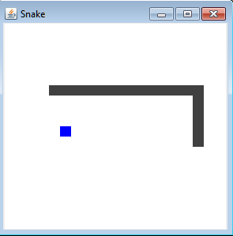

<h1>Sobre</h1>

Códigos de estudos para exercitar o conhecimento sobre a linguagem java.
Utilizei a plataforma GitHub como meio de organizar os Códigos e compartilhar os resultados.

<h2>Conteudo:</h2>
<ul>
  <li>Swing</li>
  <li>Threads</li>
  <li>Collections</li>
  <li>Events</li>
</ul>

<h3>Resultado: </h3>

